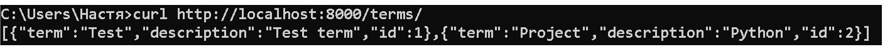

# REST. FastAPI. Swagger

## Задание

Реализуйте задание практики, опубликованное по ссылке, с использованием FastAPI, предоставьте ссылку на репозиторий GitHub со всеми необходимыми компонентами для развертывания. При возможности, разверните словарь на публичном сервере в вебе. 

В репозитории отразите отчет с помощью файла с разметкой Markdown, где демонстрировался бы процесс развертывания и работы сервиса.

Глоссарий должен поддерживать следующие операции:

- Получение списка всех терминов.
- Получение информации о конкретном термине по ключевому слову.
- Добавление нового термина с описанием.
- Обновление существующего термина.
- Удаление термина из глоссария.

Этот проект представляет собой REST API для управления глоссарием с использованием FastAPI и SQLite. Он позволяет добавлять, изменять, удалять и получать термины в глоссарии.

Использование SQLite позволяет не запускать отдельный контейнер с базой данных

## Swagger

- Swagger: [http://localhost:8000/docs](http://localhost:8000/docs)


## Информация о запросах на стороне сервера


## Запросы глоссария

### Добавить термин

```bash
curl -X POST "http://127.0.0.1:8000/terms/" -H "Content-Type: application/json" -d "{\"term\": \"Test\", \"description\": \"Test term\"}"
```


### Добавление существующего термина

```bash
curl -X POST "http://127.0.0.1:8000/terms/" -H "Content-Type: application/json" -d "{\"term\": \"Test\", \"description\": \"Test term\"}"
```


### Получить все термины

```bash
curl http://localhost:8000/terms/
```



### Удалить термин

```bash
curl -X DELETE http://localhost:8000/terms/Project
```


### Обновление термина

```bash
curl -X PUT "http://localhost:8000/terms/Test" -H "Content-Type: application/json" -d "{\"description\": \"New Test\"}"
```


